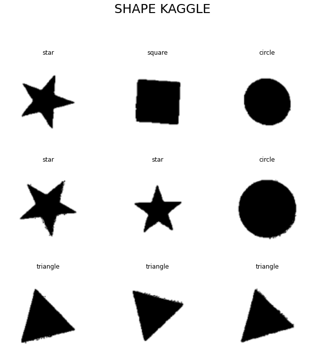
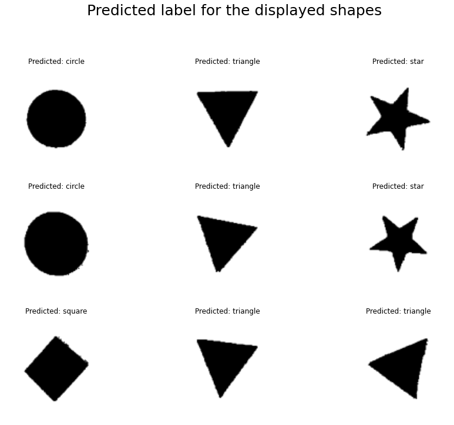
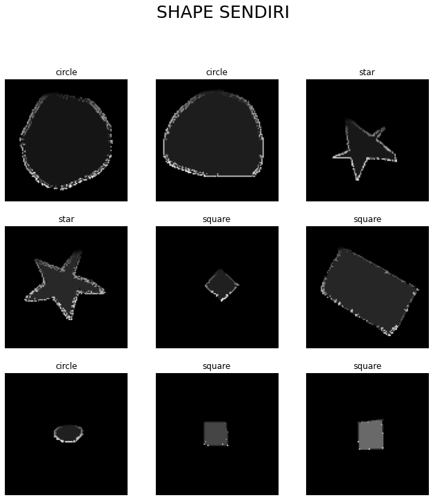
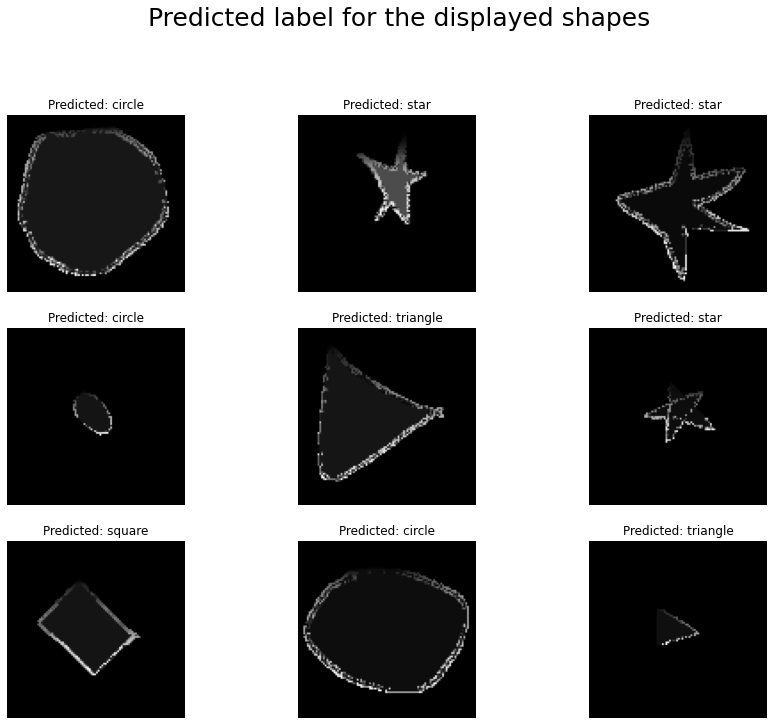
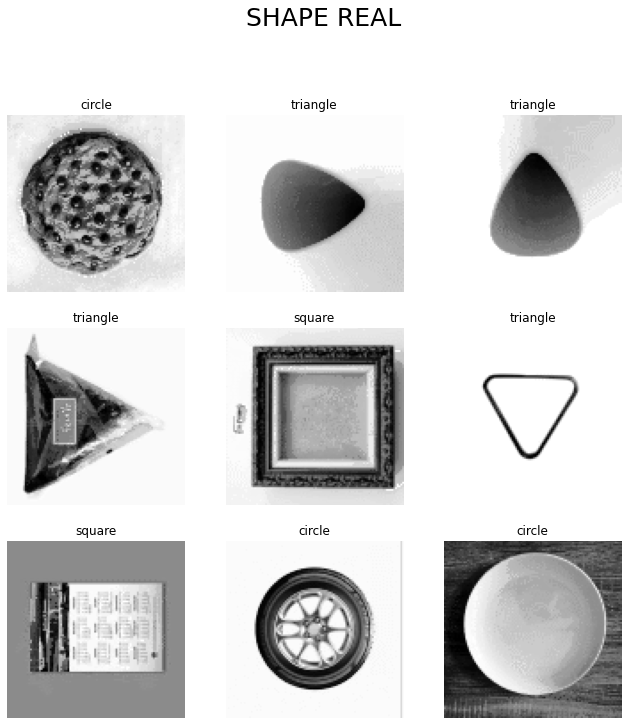
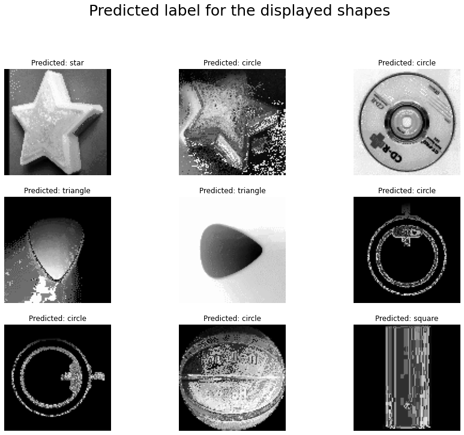

# Shape Recognition CNN
CNN is a class of artificial neural network (ANN), most commonly applied to analyze visual imagery.

## Team
- [Alfred / C14190016](https://github.com/AlfredWibowo)
- [Ardian / C14190018](https://github.com/ardian1244)
- [David / C14190040](https://github.com/DavidIvanSantoso)

## Preview
      
      
      
